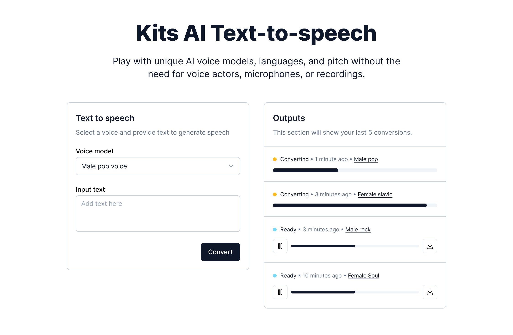

# Frontend coding challenge

You're en engineer working on an AI Text-to-speech app. Your task is to use the Kits AI public API to build the Text-to-speech page.

You can take a look at the mocks [here](https://www.figma.com/file/yyaCHT97J1ho8GSfi1qyA6/Frontend-Interview-Figma?type=design&node-id=0%3A1&mode=design&t=DDdyCbrTgeNEOWMa-1)



The public API docs can be accessed [here](https://docs.kits.ai/api)

You're going to use the Voice Model API to fetch model information, and the Text-to-Speech (TTS) API to create and fetch TTS jobs.

### Requirements

- The user should be able to input text into a text area
- The user should be able to select a voice from a dropdown. The voice options should be fetched from the Voice Model API and which models to show is up to you. Feel free to display only the first page of models.
- When the user clicks the "Convert" button, the text should be converted to speech. You can use the TTS API to do this.
- The right section of the page should display the converted speech output.
- The conversion takes some time to process and we should show appropriate loading states. Expect the conversion to take about 10 seconds, but it can take longer.
- After the conversion is complete, the user should be able to download the speech output as an audio file. Bonus points for making the output playable in the browser.

We already have a Next.js project set up for you. You can clone this repo and start working on the project. It has the basic structure and styles set up for you. It uses TailwindCSS for styling and has TypeScript support as well. You can use any UI library you're comfortable with (we like Shadcn) or build from scratch.

You're also free to install any other packages you want to use.

First, run the development server:

```bash
npm run dev
```

Open [http://localhost:3000](http://localhost:3000) with your browser to see the result.

### Expectations

We expect you to complete the task in no more than a few hours. You can spend more time if you want to, but it's not necessary. We intentionally don't provide a lot of details so you can make decisions on your own.

We're looking for the following things:

- The code works! It should be bug-free and work as expected
- The code is well structured and easy to read
- If you have extra time and want to show off, you can improve the user experience

### Learn More

To learn more about Next.js, take a look at the following resources:

- [Next.js Documentation](https://nextjs.org/docs) - learn about Next.js features and API.
- [Learn Next.js](https://nextjs.org/learn) - an interactive Next.js tutorial.
